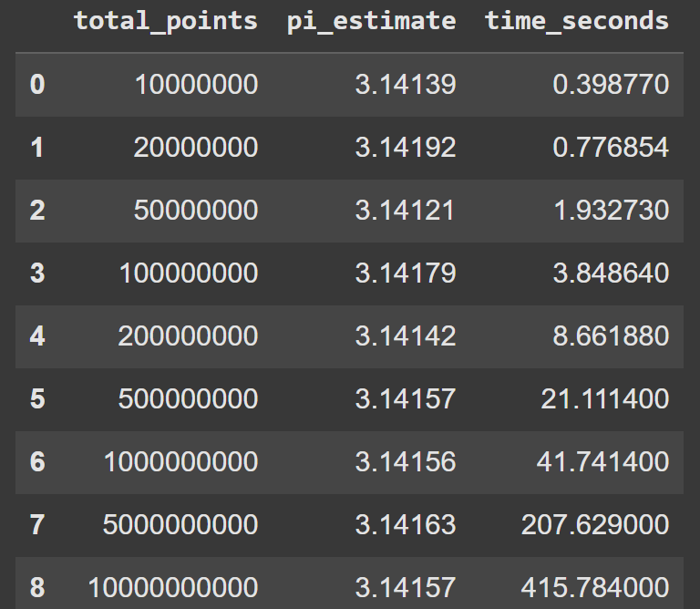
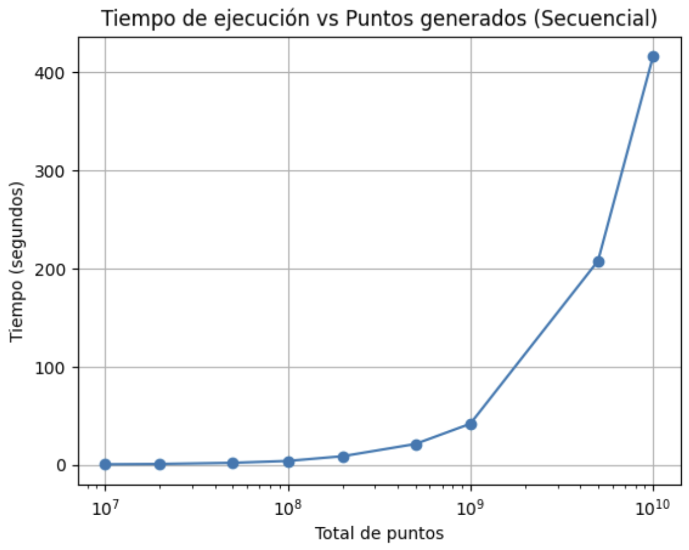
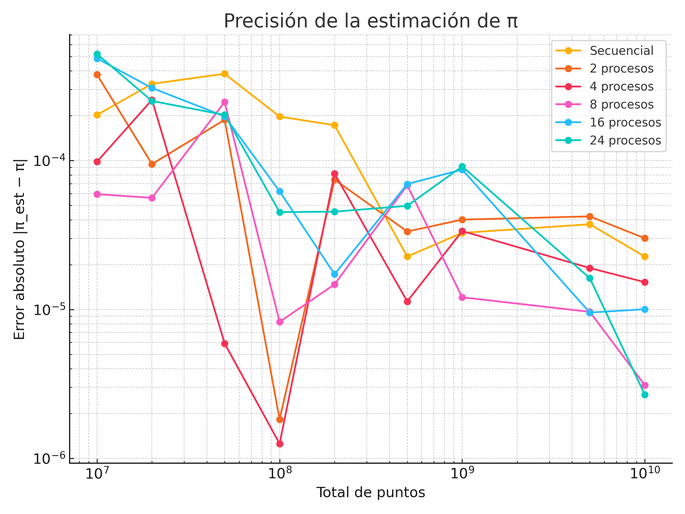
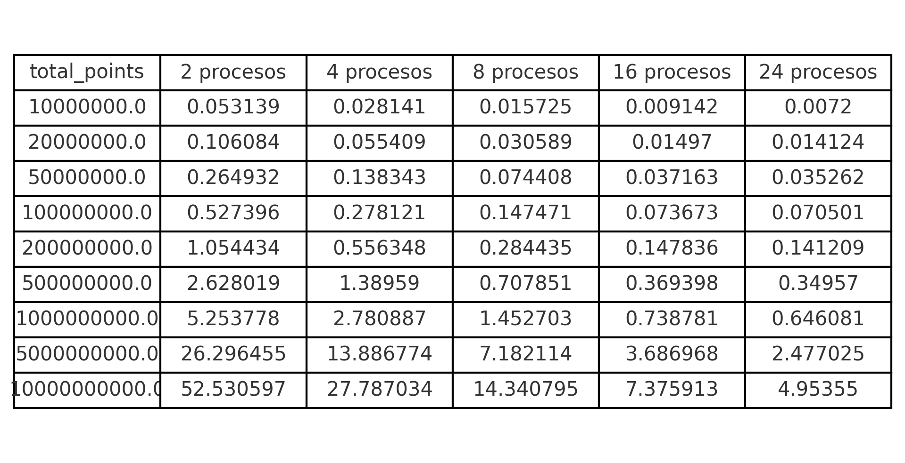
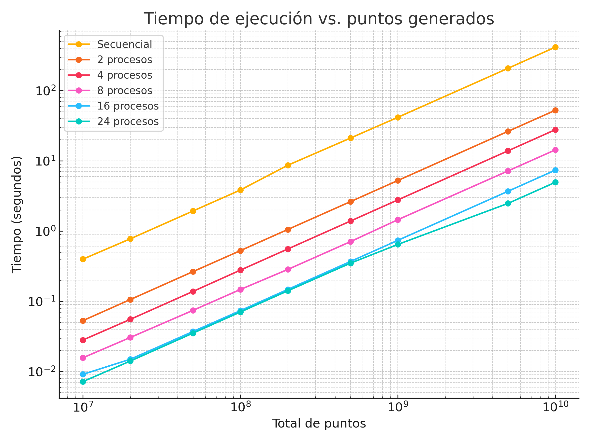
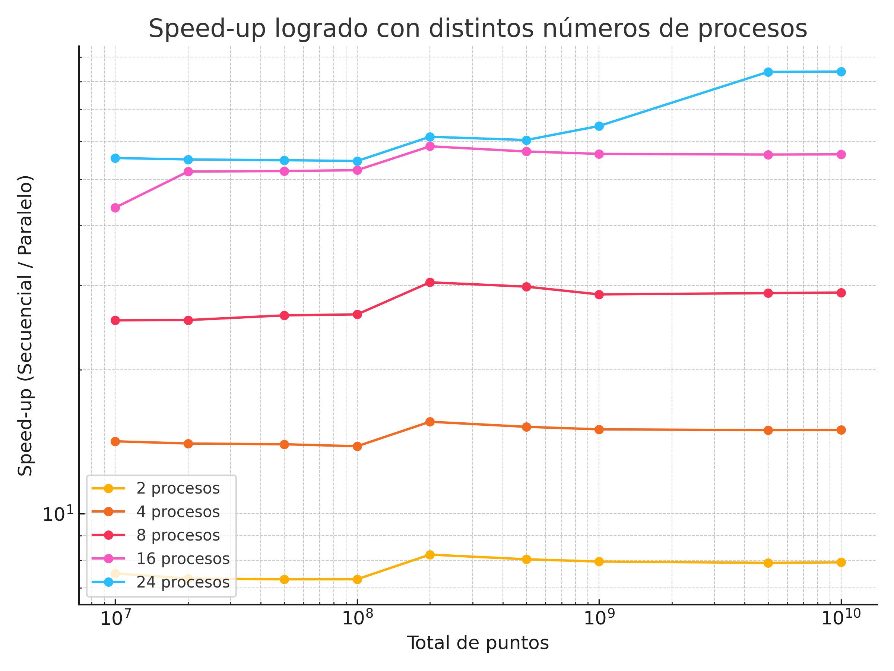

# Parallel Monte Carlo Simulation for Estimating Pi

## Author and Contact

Leo Tapia  
[leoatapia309@gmail.com]

## License

GNU General Public License v3.0

## Affiliation

Final project for the High-Performance Computing (Supercomputing) 2025-2 class, designed and developed at the National Autonomous University of Mexico (UNAM), The tests were performed in the Interdisciplinary Laboratory of Scientific Computing.

---

## Introduction

Estimating the mathematical constant Pi (π) using the Monte Carlo method is a classic example of stochastic simulation in scientific computing. The method involves generating random points within a square and determining the proportion that fall inside an inscribed circle. This ratio can be used to approximate the value of Pi.

As the required number of points grows for higher accuracy, computation time becomes a limiting factor. By leveraging High-Performance Computing (HPC) and parallel programming, it is possible to significantly reduce execution times, making this method practical for large-scale simulations and for illustrating the benefits of parallelization in scientific problems.

---

## Justification

Simulations based on random sampling, such as Monte Carlo, are widely used in areas from physics to finance. However, high-precision estimations require evaluating millions or billions of points, quickly turning into a computationally expensive task.

Modern multi-core CPUs can evaluate these points in parallel, accelerating convergence and reducing wall time. This project aims to demonstrate the power and practical benefit of parallel computing using the Monte Carlo estimation of Pi as a didactic and illustrative example.

---

## Hypothesis

A significant reduction in simulation time for estimating Pi can be achieved by parallelizing the Monte Carlo algorithm with multithreading or distributed computing, compared to its sequential execution.

---

## General Objective

Implement a parallel algorithm using the Monte Carlo method to estimate Pi, leveraging high-performance computing techniques to efficiently utilize multi-core architectures.

---

## Particular Objectives

- Develop a correct and efficient sequential implementation of the Monte Carlo simulation for Pi estimation.
- Implement the parallel version using multithreading.
- Measure and compare the performance (execution time and scalability) between the sequential and parallel implementations.
- Analyze the trade-off between number of points, accuracy, and computation time.

---

## Toolset

- **Programming language:** C   
- **Testing environment:** Interdisciplinary Laboratory of Scientific Computing, ENES Morelia (UNAM)

---

## Algorithm Methodology

The simulation follows these steps:

1. **Random Point Generation:**  
   Each point is generated within the interval \([-1, 1]\) for both the \(x\) and \(y\) axes.

2. **Point Evaluation:**  
   A point \((x, y)\) is considered inside the circle if:

   $$
   x^2 + y^2 \leq 1
   $$

3. **Parallel Work Distribution:**  
   The total number of points is divided among available threads.  
   Each thread independently counts the number of points that fall inside the circle.

4. **Result Aggregation:**  
   After all threads complete, their local counts are summed to compute the global number of points inside the circle.

5. **Final Calculation:**  
   The value of π is estimated using the formula:

π ≈ 4 × (N_inside / N_total)

where:
- N_inside: Number of points inside the circle
- N_total: Total number of generated points

---

## Parallelization

- **Parallel Model:**  
  Each thread operates independently on a subset of points.  
  This is considered an _embarrassingly parallel_ problem.

- **Synchronization:**   
  Required only once at the end of the simulation, when combining the values of N_inside (the number of points inside the circle) calculated independently by each thread.

- **Scalability:**  
  The algorithm scales nearly linearly with the number of CPU cores.  
  As more cores are used, execution time decreases significantly, allowing for the simulation of more points in less time.

---

## Resultados

### Rendimiento secuencial

### Estimación de π (secuencial)

### Gráfica de precisión de π

## Rendimiento Paralelo

### Tabla Paralela (10⁷ – 10¹⁰ puntos)

### Rendimiento
| Métrica | Descripción | Imagen |
|---------|-------------|--------|
| **Tiempo vs Puntos** | Escalabilidad fuerte al incrementar el tamaño de la muestra. |  |
| **Speed-up** | Aceleración lograda respecto a la versión secuencial para 2-24 procesos. |  |
| **Precisión** | Error absoluto de la estimación de π frente a la referencia. |  |

## References

- [Monte Carlo Method — Wikipedia](https://en.wikipedia.org/wiki/Monte_Carlo_method)  
- [Parallel Programming with OpenMP — LLNL](https://computing.llnl.gov/tutorials/openMP/)  

